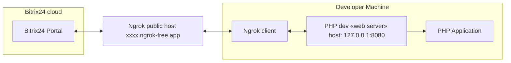
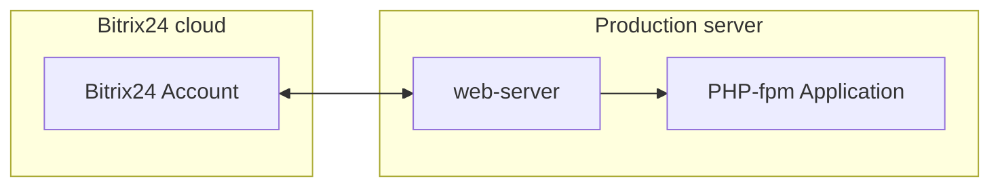

# 04-umd-frame

This example demonstrates a local application for educational purposes.

## Architecture

### Developer configuration for local development on his machine



### Production configuration



## Installation and running

### Installation of SDK

1. Open shell and go to folder `/js/04-umd-frame/`
2. Install dependencies via npm

```shell
npm install
```

3. Open package.json and run command "dev"

This command will start the PHP web server, the ngrok client, and the Tailwind CSS run-time. The PHP web server will serve your application locally, the ngrok client will expose your local server to the internet, and the Tailwind CSS run-time will process your CSS files. For more information, you can refer to the following documentation:

- [PHP Built-in Web Server](https://www.php.net/manual/en/features.commandline.webserver.php)
- [Ngrok](https://ngrok.com/docs)
- [Tailwind CSS](https://tailwindcss.com/docs)

> [!WARNING]  
> This web server is intended for application development and testing purposes only. It may also be useful for controlled environment demonstrations. It is not designed to be a full-featured web server.

To check if the PHP web server is started, open another terminal tab or window and navigate to `http://127.0.0.1:8080` in your web browser. If the server is running, you should see your application or a directory listing.

To check if the ngrok client is started, open another terminal tab or window and navigate to the URL provided by ngrok in your web browser. The URL will look something like `http://<random-subdomain>.ngrok-free.app`. If ngrok is running, you should see your application.

The ngrok client output in the terminal will look something like this:

```plaintext
Session Status                online
Account                       YourAccount (Plan: Free)
Update                        update available (version 3.16.0, Ctrl-U to update)
Version                       3.10.0
Region                        United States (us)
Latency                       196ms
Web Interface                 http://127.0.0.1:4040
Forwarding                    https://<random-subdomain>.ngrok-free.app -> http://127.0.0.1:8080
```

4. Open the ngrok local web interface at [http://127.0.0.1:4040/](http://127.0.0.1:4040/) to view the latest requests.
5. Navigate to your Bitrix24 portal, go to the left menu, select "Developer resources," then "Other," and finally "Local application."
6. Choose the "server" type of application.
7. In the "handler path" field, enter your forwarding address: `https://<random-subdomain>.ngrok-free.app/index.php`.
8. In the "Initial installation path" field, enter your forwarding address: `https://<random-subdomain>.ngrok-free.app/install.php`.
9. Assign the necessary permissions and add the scope: `user_brief`, `crm`.
10. Click the "Save" button, then click the "reinstall" button.
11. You should see:
    - A POST request to `https://<random-subdomain>.ngrok-free.app/install.php` in the ngrok web interface at [http://127.0.0.1:4040/](http://127.0.0.1:4040/).
    - Detailed data in the application log located in the `var/log/application-*.log` folder.
12. Now that the application data and admin token are stored, you can make requests to the Bitrix24 REST API. Open `https://<random-subdomain>.ngrok-free.app/external.php` in your browser to see your Bitrix24 user data.
