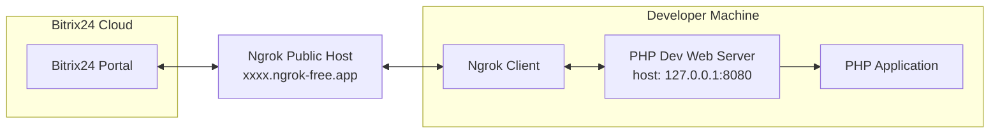
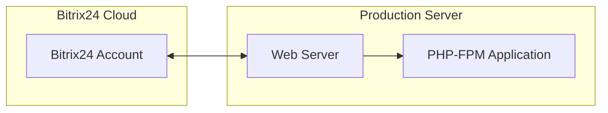

# Using special widget and configurable activities in CRM timeine

This example demonstrates a local application for educational purposes.

1. The application **needs to** store the admin token and utilize it.
2. The application **needs to** save application-specific data in a local file.
3. The application **needs to** create widget in CRM timeline.
4. Добавленные виджет предоставляет пользователю возможность взаимодействовать с ним, а по завершению ввода данных, приложение должно отправить данные в CRM в виде конфигурируемого интерактивного дела.

## Example Folder Structure

```plaintext
/config
    .env - Example environment configuration file
    .env.local - Local environment configuration file (not committed to version control)
    auth.json.local - Authentication data from the application
/public - Directory served by the web server
    /css - Directory for widget styles
        app.css - Stylesheet for the widget
    index.php - Main script loaded by default
    install.php - Script for saving the initial OAuth tokens and handling installation steps
    handler.php - Script for handling widget logic
    action.php - Обработчик для создания конфигурируемого дела
/src
    Application.php - Example of a local application, which is used to store the admin token and register a widget
/var
    /log - Directory for log files
        application-YYYY-m-d.log - Application log file
composer.json - Composer configuration file defining project dependencies and metadata
composer.lock - Automatically generated by Composer to ensure consistent dependency versions
```

## Architecture

### Developer Configuration for Local Development



### Production Configuration



## Installation and Running

### Installing the SDK

1. Open a shell and navigate to the `/php/special/custom-activities/` folder.
2. Install dependencies via Composer:

```shell
composer install
```

3. Start the PHP web server and Ngrok client:

```shell
cd public
php -S 127.0.0.1:8090
```

```shell
ngrok http 127.0.0.1:8090 --domain <random-subdomain>.ngrok-free.app
```

These commands will start the PHP web server and the Ngrok client. The PHP web server will serve your application locally, and the Ngrok client will expose your local server to the internet. For more information, refer to the following documentation:

- [PHP Built-in Web Server](https://www.php.net/manual/en/features.commandline.webserver.php)
- [Ngrok](https://ngrok.com/docs)

> [!WARNING]  
> This web server is intended for application development and testing purposes only. It may also be useful for controlled environment demonstrations. It is not designed to be a full-featured web server.

To check if the PHP web server is running, open another terminal tab or window and navigate to `http://127.0.0.1:8080` in your web browser. If the server is running, you should see your application or a directory listing.

To check if the Ngrok client is running, open another terminal tab or window and navigate to the URL provided by Ngrok in your web browser. The URL will look something like `http://<random-subdomain>.ngrok-free.app`. If Ngrok is running, you should see your application.

The Ngrok client output in the terminal will look something like this:

```plaintext
Session Status                online
Account                       YourAccount (Plan: Free)
Update                        update available (version 3.16.0, Ctrl-U to update)
Version                       3.10.0
Region                        United States (us)
Latency                       196ms
Web Interface                 http://127.0.0.1:4040
Forwarding                    https://<random-subdomain>.ngrok-free.app -> http://127.0.0.1:8080
```

4. Open the Ngrok local web interface at [http://127.0.0.1:4040/](http://127.0.0.1:4040/) to view the latest requests.
5. Navigate to your Bitrix24 portal, go to the left menu, select "Developer Resources," then "Other," and finally "Local Application."
6. Choose the "Server" type of application.
7. In the "Handler Path" field, enter your forwarding address: `https://<random-subdomain>.ngrok-free.app/index.php`.
8. In the "Initial Installation Path" field, enter your forwarding address: `https://<random-subdomain>.ngrok-free.app/install.php`.
9. Assign the necessary permissions and add the scope: `user_brief`.
10. Click the "Save" button, then click the "Reinstall" button.
11. You should see:
    - A POST request to `https://<random-subdomain>.ngrok-free.app/install.php` in the Ngrok web interface at [http://127.0.0.1:4040/](http://127.0.0.1:4040/).
    - Detailed data in the application log located in the `var/log/application-*.log` folder.
    - The stored admin auth token in the `config/auth.json.local` file.
12. Go to the `config` folder and make a copy of the `.env` file:

```shell
cp .env .env.local
```

13. Open the `.env.local` file and copy the secret data from your Bitrix24 local application settings:
    - `Application ID (client_id)` to `BITRIX24_PHP_SDK_APPLICATION_CLIENT_ID`
    - `Application Key (client_secret)` to `BITRIX24_PHP_SDK_APPLICATION_CLIENT_SECRET`
    - `Assign Permissions` (scope) to `BITRIX24_PHP_SDK_APPLICATION_SCOPE`

Your file should look like this example:

```plaintext
BITRIX24_PHP_SDK_APPLICATION_CLIENT_ID='YOUR_DATA_HERE'
BITRIX24_PHP_SDK_APPLICATION_CLIENT_SECRET='YOUR_DATA_HERE'
BITRIX24_PHP_SDK_APPLICATION_SCOPE='user_brief'
```
